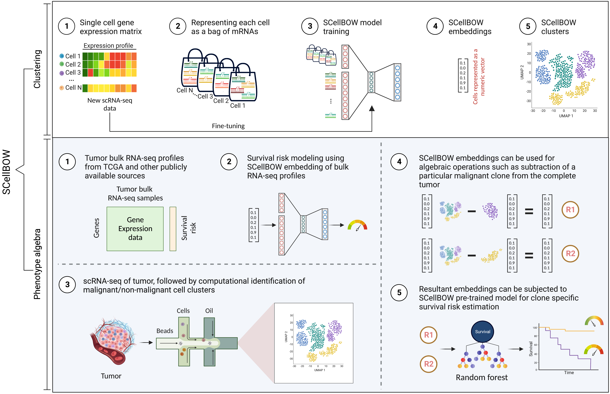

## SCellBOW : Single-cell RNA-seq analysis and transfer learning using language models

SCellBOW is an unsupervised transfer learning algorithm for clustering scRNA-seq data and phenotype algebra analysis on the clusters using distributed Bag-of-Words. SCellBOW enables the transformation of scRNA-seq data expression matrices to a low-dimensional vector space, where genes are analogous to words, and cells are analogous to documents. Construction of these cell documents enables the direct application of tools from Natural Language Processing (NLP) to the analysis of single-cell sequencing data. SCellBOW shows that NLP in amalgation with transfer learning allows a better representation of cell clusters which can help to decipher the heterogeneity of cells, especially in cancer genomics. SCellBOW facilitates robust identification of malignant clusters and enables stratification of the clusters based on their survival-risk.

<!-- \For thorough details, see our paper: [https://www.nature.com/articles/s41467-020-15851-3](https://www.nature.com/articles/s41467-020-15851-3) -->
 

